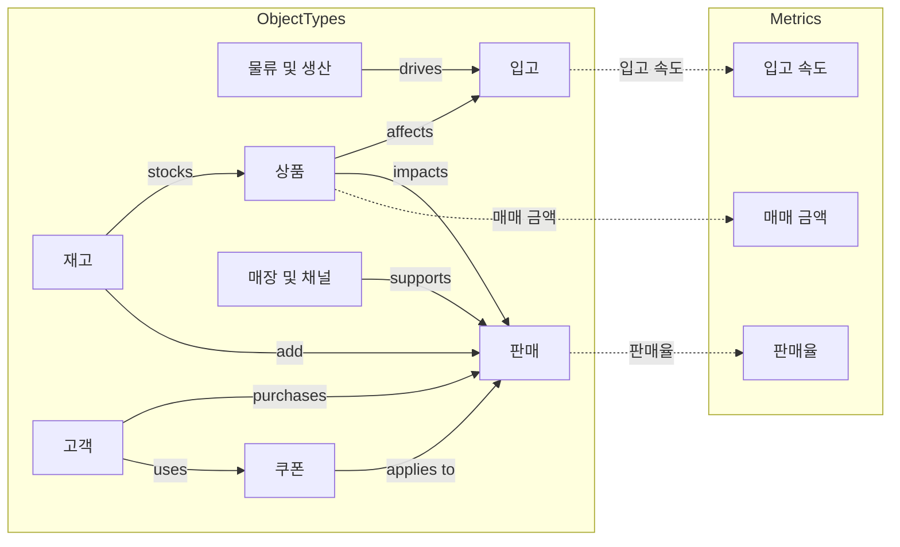

### Domain 정보

```mermaid
flowchart LR
  subgraph ObjectTypes
    물류생산[물류 및 생산]
    상품[상품]
    입고[입고]
    재고[재고]
    판매[판매]
    매장채널[매장 및 채널]
    고객[고객]
    쿠폰[쿠폰]
  end

  subgraph Metrics
    입고속도[입고 속도]
    판매율[판매율]
    매매금액[매매 금액]
  end

  물류생산 -->|drives| 입고
  상품 -->|affects| 입고
  상품 -->|impacts| 판매
  재고 -->|stocks| 상품
  재고 -->|add| 판매
  매장채널 -->|supports| 판매
  고객 -->|purchases| 판매
  고객 -->|uses| 쿠폰
  쿠폰 -->|applies to| 판매

  입고 -.->|입고 속도| 입고속도
  판매 -.->|판매율| 판매율
  상품 -.->|매매 금액| 매매금액
```