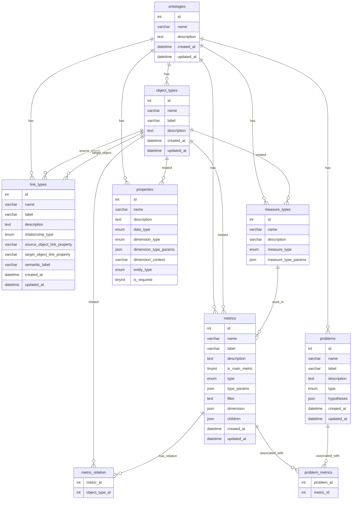

아래 정보를 바탕으로 curl 을 통해서 요청을 전달해줘.

BASE_URL = https://llana.soneuro-handmade.com

[openapi 포맷](./../../doc/openapi.json)

**API 예시**

```shell
curl --location --request GET 'https://llana.soneuro-handmade.com/ontologies/' \
--header 'Content-Type: application/json' \
--header 'Accept: application/json' \
--data '{
  "fields": [
    "<string>",
    "<string>"
  ],
  "relations": [
    "<string>",
    "<string>"
  ],
  "page": "<string>",
  "limit": "<number>",
  "offset": "<number>",
  "sort": "<string>",
  "id": "<number>",
  "name": "<string>",
  "description": "<string>",
  "created_at": "<unknown>",
  "updated_at": "<unknown>"
}'
```

### ER Diagram


