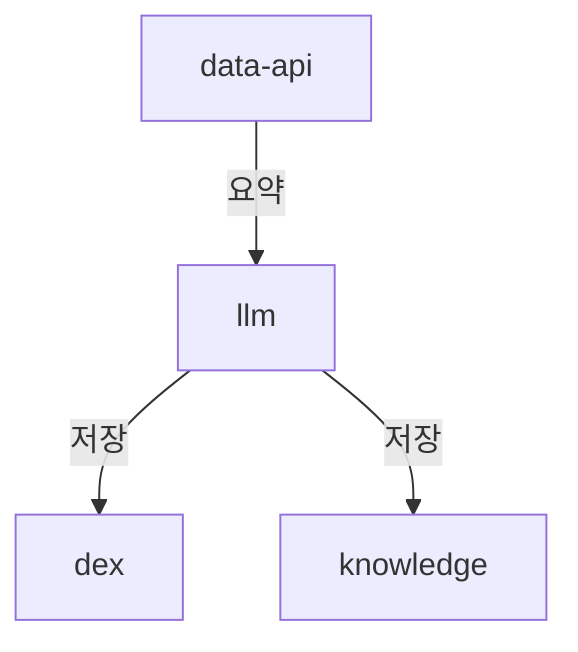

```mermaid
flowchart
    A["data-api"]
    B["knowledge"]
    C["llm"]
    D["dex"]

    A -->|요약| C
    C -->|저장| D
    C -->|저장| B

```

### 수익

= `수량` x `제품의 마진`

= `수량` x `제품의 가격` x `마진율`

= `조회수` x `전환율` x `제품의 가격` x `마진율`

= `콘텐츠 조회수` x `제품의 퀼리티 및 시장가치` x `콘텐츠 품질` x `비용 효율성`

